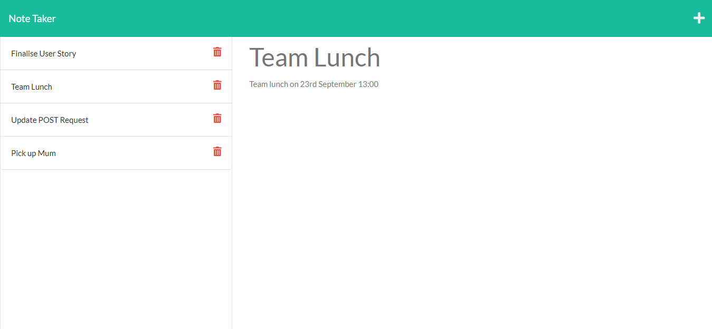

# Note Taker

## Task

This task was to demonstrate my knowledge of express.js by making a note taking application. This involved using front end HTML and JavaScript to make requests to our server, where responses and actions would take place depending on which request was sent. A GET request and handler is used to serve up both the index page and the notes page. An POST request and handler is used to add notes to the webpage and database (which in our case is a JSON file). A delete request and handler is used to delete notes. 

## Screenshot

## Links
[Link to Deployed Application](https://stark-headland-34041.herokuapp.com/)

[Link to Repository](https://github.com/kevinjr1998/Note_Taker)